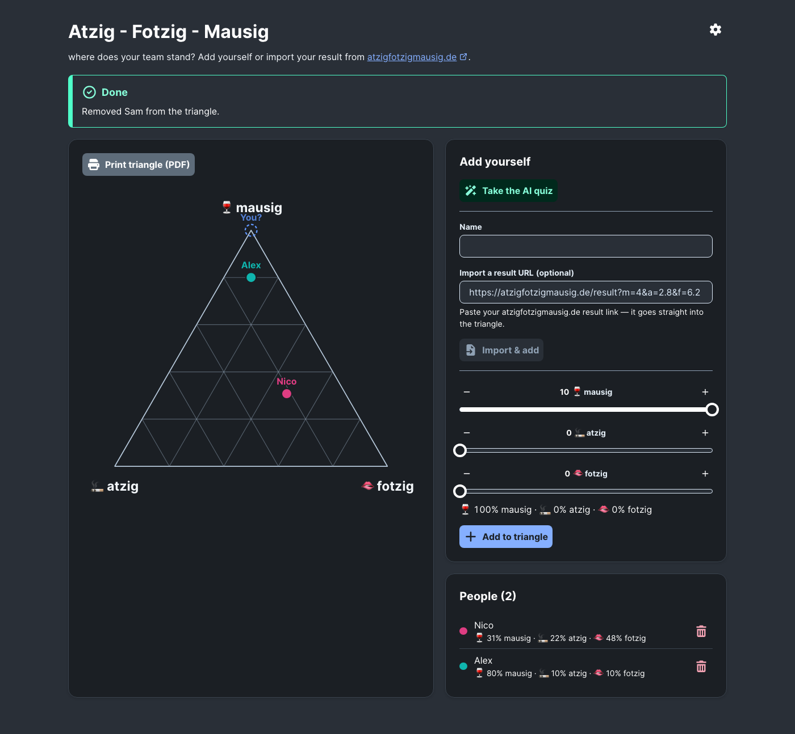
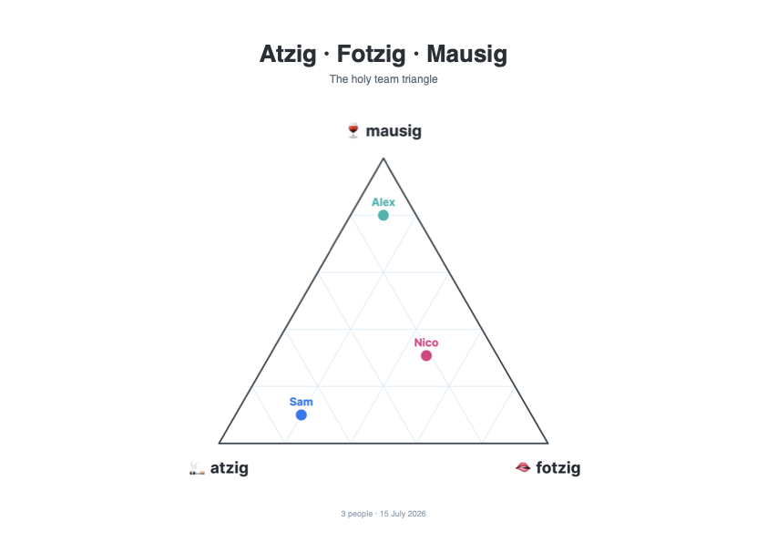
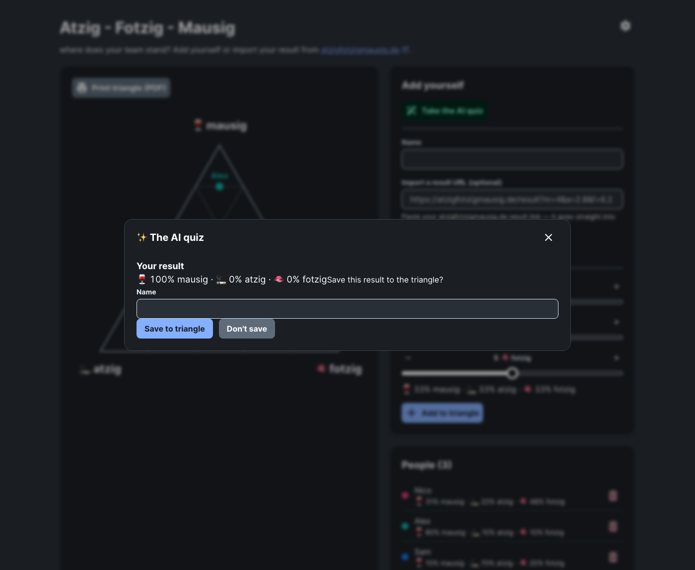
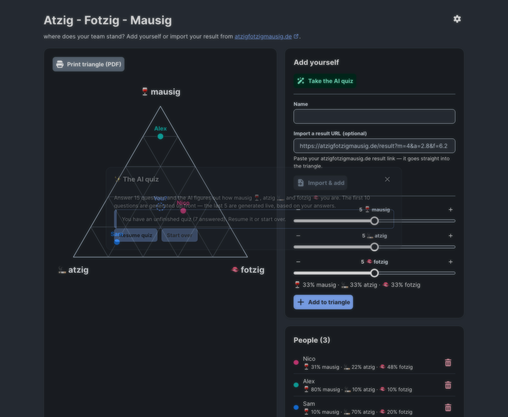
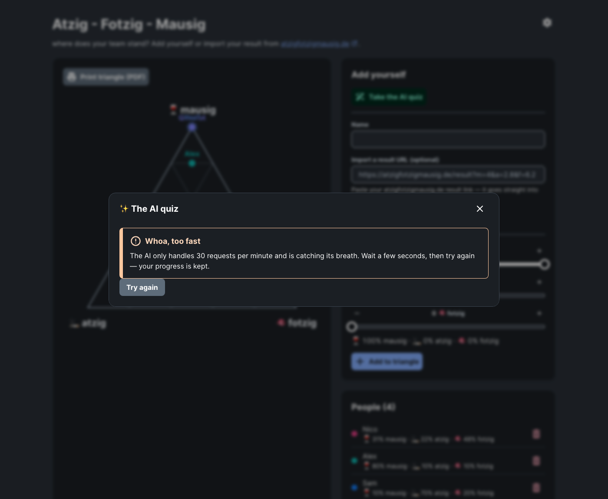
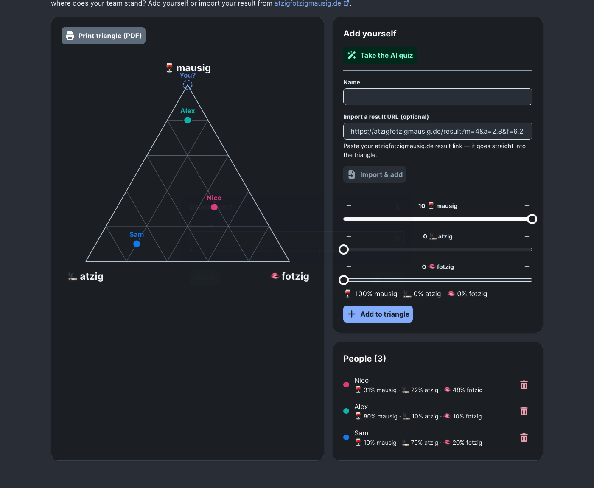

# Atzig-Fotzig-Mausig Triangle

A team triangle inspired by [atzigfotzigmausig.de](https://atzigfotzigmausig.de):
place yourself on a ternary chart between **mausig 🍷**, **atzig 🚬**, and **fotzig 🫦**.
Entries are stored server-side in a simple JSON file. You can also import your
result URL from atzigfotzigmausig.de (`…/result?m=4&a=2.8&f=6.2`) and export the
triangle as a pretty A4 PDF. The UI uses the mStudio dark theme via Flow design tokens.

See [REQUIREMENTS.md](./REQUIREMENTS.md) for requirements and the implementation plan.

## Screenshots

| | |
| --- | --- |
|  The app (mStudio dark theme) |  "Print triangle" PDF export |
|  Quiz result popup with save prompt |  Resuming an aborted quiz |
|  Friendly rate-limit banner (429) |  Delete dialog once protection is enabled |

## Stack

- React 19 + Vite + TypeScript, UI components from
  [mittwald Flow](https://github.com/mittwald/flow) (`@mittwald/flow-react-components`)
- Express server (Node 24) serving the API and the built frontend
- Persistence: JSON file at `$DATA_DIR/people.json` (defaults to `./data` locally,
  `/data` volume in the container)

## Development

```shell
npm install
npm run dev   # Express on :3000 + Vite dev server on :5173 (proxies /api)
```

## Production build

```shell
npm run build # type-check + vite build → dist/
npm start     # serves dist/ and the API on :3000
```

## AI quiz

The quiz generates its questions through an OpenAI-compatible LLM gateway. The first
10 questions are fetched in a single request; the final 5 are generated one by one
based on the answers so far. Configuration (environment variables, all server-side):

| Variable             | Purpose                                                        |
| -------------------- | -------------------------------------------------------------- |
| `LLM_BASE_URL`       | Gateway base URL including `/v1`                                |
| `LLM_SECRET`         | Bearer token — never exposed to the browser                     |
| `LLM_MODEL`          | Primary model (default `Qwen3.6-35B-A3B-FP8`)                   |
| `LLM_FALLBACK_MODEL` | Retry model on errors/429 (default `Mistral-Medium-3.5-128B`)   |

Locally, put these in a `.env` file (loaded via `node --env-file-if-exists`).
Aborted quizzes are cached in localStorage and can be resumed for 24 hours.

## API

| Method | Path                       | Description                                            |
| ------ | -------------------------- | ------------------------------------------------------ |
| GET    | /api/people                | List all people                                        |
| POST   | /api/people                | Add a person `{name, m, a, f}` (0–10)                  |
| DELETE | /api/people/:id            | Remove a person (`X-App-Password` if protection is on) |
| GET    | /api/config                | Public UI config (`deleteRequiresPassword`)            |
| PUT    | /api/admin/delete-password | Set/clear delete password (`X-Admin-Password`)         |
| POST   | /api/quiz/questions        | Generate the 10 batch questions (one LLM request)      |
| POST   | /api/quiz/next             | Generate one adaptive question from `{history}`        |
| GET    | /healthz                   | Health check                                           |

## Deployment (mittwald container hosting)

Pushing to `main` runs `.github/workflows/deploy.yml`:

1. Builds the Docker image and pushes it to GHCR (`ghcr.io/<repo>`)
2. Updates the mittwald container stack via `mittwald/deploy-container-action@v1`
   (`deploy/stack.yaml`, image tag injected as `IMAGE_TAG`)

Required GitHub repo configuration (already set up):

- Secret `MITTWALD_API_TOKEN` — mStudio API token
- Secret `STACK_ID` — container stack UUID (look up via
  `mw stack list --project-id <p-XXXXXX>`)
- Secret `APP_PASSWORD` — **admin password** for the runtime settings dialog (gear
  icon). Deleting people is unprotected by default; a delete password can be set
  there at runtime and is stored in `settings.json` on the data volume.
- Secrets `LLM_BASE_URL`, `LLM_SECRET`, `LLM_MODEL` — the AI quiz gateway (see above)

Also make sure the GHCR image is public (or add GHCR registry credentials in
mStudio), and connect a domain/ingress to container port `3000`.
